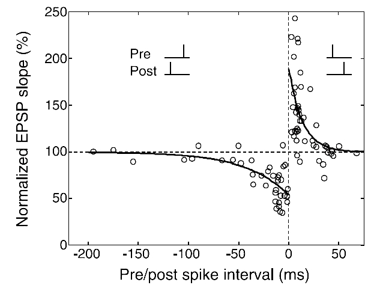

# 视觉注意时间结构特性与脉冲神经网络
## Abstract
类脑计算启发的脉冲神经网络与transformer相结合，利用transformer与snn相似的时间特性，使用spikingjelly平台设计图像识别的工具。前期通过分析总结已有的代码成果，在CML模型的基础上部署模型。设计模型训练方法，根据训练结果调整模型结构与参数，修改了原来模型的数据预处理方式以及增加了STDP梯度传播方法，更好的利用了时间特性。SNN是一种强仿生的神经网络，稀疏与时序的特征让他具有硬件友好的低功耗性能，基于snn的图像识别将有助于未来物联网的智能化。cifar100数据集的测试结果，acc1（第一个结果为正确）达到85.75%(从原先的79.21%提高到85.75%)，acc5（五个中有正确结果）达到97.75%.eval_loss减小到0.704469。在神经形态MINIS数据中，准确率达到99.41%.
## STDP介绍
突触是神经元之间在功能上发生联系的部位，是信息传递的关键部位。当上游神经元放电时，脉冲信号通过突触刺激下游神经元的膜电位。从功能来看，突触可以分为兴奋性突触和抑制性突触两类。突触前神经元脉冲通过突触传递，影响突触后神经元的活动，若输入的脉冲增加突触后神经元的膜电位，即为兴奋性突触；若输入的脉冲降低突触后神经元的膜电位，即为抑制性突触。突触连接强度决定了神经元膜电位变化的大小，可视为两个神经元连接的权重表征。研究发现，突触强度是可调节的，会随着突触连接的前后神经元发放脉冲的相对时间推移而增强或减弱，这种现象被称为脉冲时间相关的突触可塑性。STDP规则揭示了突触结构内权重变化的过程，已被引入SNN模型，用来增加生物可信度.

其中AB为突触权重变化最大值，tao为常数。
