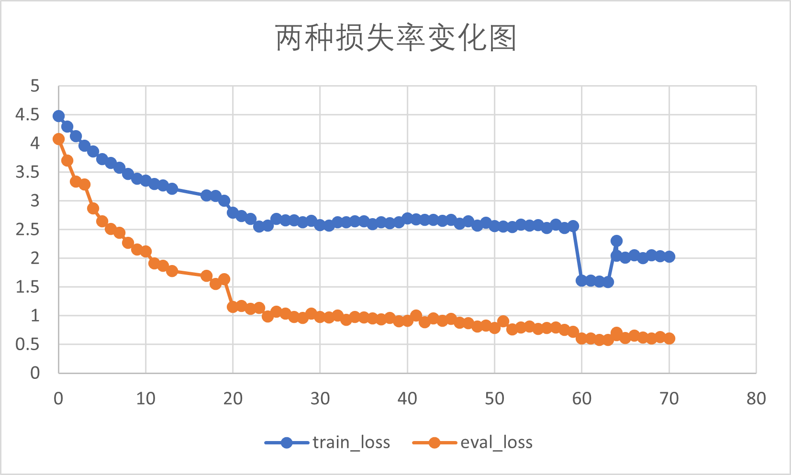

# 视觉注意时间结构特性与脉冲神经网络
## Abstract
类脑计算启发的脉冲神经网络与transformer相结合，利用transformer与snn相似的时间特性，使用spikingjelly平台设计图像识别的工具。前期通过分析总结已有的代码成果，在CML模型的基础上部署模型。设计模型训练方法，根据训练结果调整模型结构与参数，修改了原来模型的数据预处理方式以及增加了STDP梯度传播方法，更好的利用了时间特性。SNN是一种强仿生的神经网络，稀疏与时序的特征让他具有硬件友好的低功耗性能，基于snn的图像识别将有助于未来物联网的智能化。cifar100数据集的测试结果，acc1（第一个结果为正确）达到85.75%(从原先的79.21%提高到85.75%)，acc5（五个中有正确结果）达到97.75%.eval_loss减小到0.704469。在神经形态MINIS数据中，准确率达到99.41%.
## SNN介绍
脉冲神经网络（Spiking Neural Networks, SNNs）被认为是第三代神经网络。因为SNNs的设计更加贴近生物神经系统的工作机制，特别是在模拟神经元的动作电位（即神经脉冲）和时间编码方面。与传统的第二代神经网络使用频率编码不同，SNNs采用时间编码，即信息通过脉冲发生的确切时间来编码。这种编码方式能够捕捉到时间上的动态变化，对于处理时间序列数据特别有效。SNNs在计算上更为高效，因为它们只在脉冲发生时才进行计算，这种事件驱动的计算方式减少了不必要的运算，从而降低了能耗和计算资源的需求。
## Motivation
本模型的视觉注意的时间结构特性对于脉冲神经网络的研究具有重要的启发作用。首先，将视觉注意机制与脉冲神经网络结构进行比较，可以发现两者具有很大的相似性。其次，视觉注意的时间结构与脉冲神经网络的时间信息处理机制相契合，对于数据脉冲编码和网络设计有明显的启发性，在脉冲神经网络中引入了脉冲编码的注意力机制，根据输入的时间序列数据和空间位置来分配注意资源。例如，根据输入的脉冲信号的时间信息和强度，脉冲神经网络可以动态调整神经元之间的连接权重，从而实现在不同时间和空间位置上的注意力分配。再者，视觉注意的时间特性可以用来指导脉冲神经网络模型的设计，尤其是在处理快速变化的视觉信息时。因此，拟设计具有视觉注意时间结构特性的脉冲神经网络，实现高效、低功耗的目标检测与识别任务。
## STDP介绍
突触是神经元之间在功能上发生联系的部位，是信息传递的关键部位。当上游神经元放电时，脉冲信号通过突触刺激下游神经元的膜电位。从功能来看，突触可以分为兴奋性突触和抑制性突触两类。突触前神经元脉冲通过突触传递，影响突触后神经元的活动，若输入的脉冲增加突触后神经元的膜电位，即为兴奋性突触；若输入的脉冲降低突触后神经元的膜电位，即为抑制性突触。突触连接强度决定了神经元膜电位变化的大小，可视为两个神经元连接的权重表征。研究发现，突触强度是可调节的，会随着突触连接的前后神经元发放脉冲的相对时间推移而增强或减弱，这种现象被称为脉冲时间相关的突触可塑性。脉冲神经网络（SNN）的反向传播与传统的人工神经网络（ANN）存在显著差异，因为SNN的激活函数是不可导的。在传统的ANN中，反向传播算法通过计算损失函数相对于网络参数的梯度来更新权重。然而，由于SNN使用尖峰（spikes）作为信息传递的基本单元，并且尖峰的发生是离散和非线性的，所以模型中使用了Spike-Timing-Dependent Plasticity (STDP)。STDP是一种无监督学习规则，它根据前突触和后突触尖峰的时间差异来调整突触权重。STDP不是通过反向传播误差信号实现的，而是基于局部信号来调整权重。在STDP中，通常区分突触前（pre-synaptic）和突触后（post-synaptic）神经元。尖峰的时间顺序决定了权重的更新方向：如果突触前神经元先发放尖峰，跟着是突触后神经元，突触权重一般会增加（长时程增强，LTP）；反之，则可能会减少（长时程抑制，LTD）。这被认为是更符合生物实际的传播。

>其中AB为突触权重变化最大值，tao为常数.
## 效果
> `cifar100`数据集的测试结果，acc1（第一个结果为正确）达到85.75%（从79.21%提高到85.75%），acc5（五个中有正确结果）达到97.75%.eval_loss减小到0.704469.在神经形态数据中，准确率达到99.41%.

## 使用方法
通过`--config`参数传入`cifar100.YAML`配置文件
`bash
python train.py --config path/to/your/config.yml
`
>注意修改数据集地址
